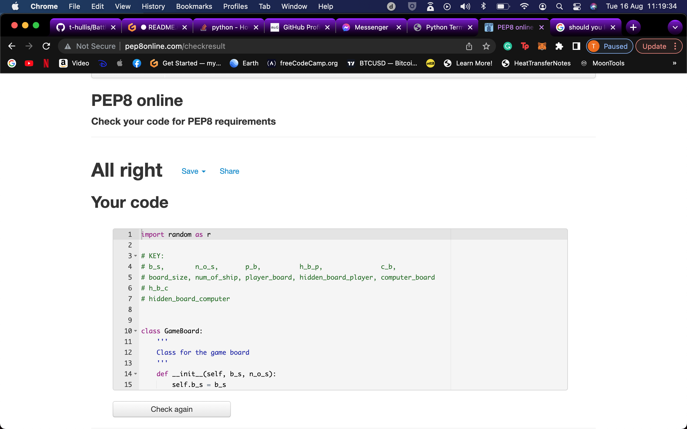

# Batttleships Game

Battleships is a terminal game, based on the classic strategy type guessing board game, which  runs on the code institute mock terminal on Heroku. 
It is played on a square grid of the users specification.
The game is won when a player finds all the opponents ships before theirs are found.
This game only has single ships.

## The Rules

    1,  Choose the size of the board (between 3 and 15) and the number of battleships
        you would like to be placed on the board.

    2,  Guess the coordinates of the ships on the computer board.

    3,  You can see where the shots have been placed on your board,
        denoted by the X for a hit and O a miss.
    
    4,  If you place a shot in the same place twise, you will lose
        that go, so make sure you shot to different coordinates 
        each time.
    
    4,  The first one to find all the oppostions battleships
        wins!

# Features

 

- Board is generated at the users request. The size of the board and the number of ships is up to the player, by inputs at the start.

- The ships placed for the computer are hidden from the user but the user can see where his own ships were placed.
 

 

 

- The programme counts the hits ships after each round and displays the score for the computer and the user.

- If the user selects a coordinate for their shot which isnt applicable, the programme returns an error and asks for new coordinates for that shot.

- To make it harder for the user, there is no function to stop shots being repeated. So if they do shoot a shot that has already been tried, they will simply loose their go.

 

 

- Once there is winner, the porgramme will anounce that winner and ask the user if they would like to replay the game or exit the programme.

 

## Data Model
I have used a Gameboard class to set up the board, making 4 instances of a hidden and display board for both the user and the computer. In this class you can set the board size and ship number with the methods within, ie: create_ships, print_board. There is also a method called fire_shots which places the shots on the board and a method called count_ships, which adds up the hit ships at the end of each round, to give the score of the game.
 

# Testing

- Passed python Pep8 online code validator.
- Tested within github on my terminal with no problems as well as on Heroku.

 

## Bugs
- I only found three bugs during this project, 
    - The x axis of the game boards was displaying the number of ships, n_o_s, rather than the size of the board. This was due to my start_game function returning its  variables in the wrong order for the run_game function.
    - The axis' of the ship hit function were the wrong way round so it wasnt detecting wether the right ship was hit.
    - When the user shot a ship that had already been hit, the H on the board turned to an O which reduced their score by one and made it impossible for them to get it back. Meaning they would automaticly lose. So i stopped the H's for being able to be over written.

These were logged in my commits.
 

# Credits and Deployment
I have depolyed the project using the code institute template for a mock terminal for Heroku.

- Code institute for the github template.
    - Steps for deployment
        1. Create a new Heroku app.
        2. Set buildpacks to Python and Node.js in that order.
        3. Link the repository and the app together.
        4. Deploy app.